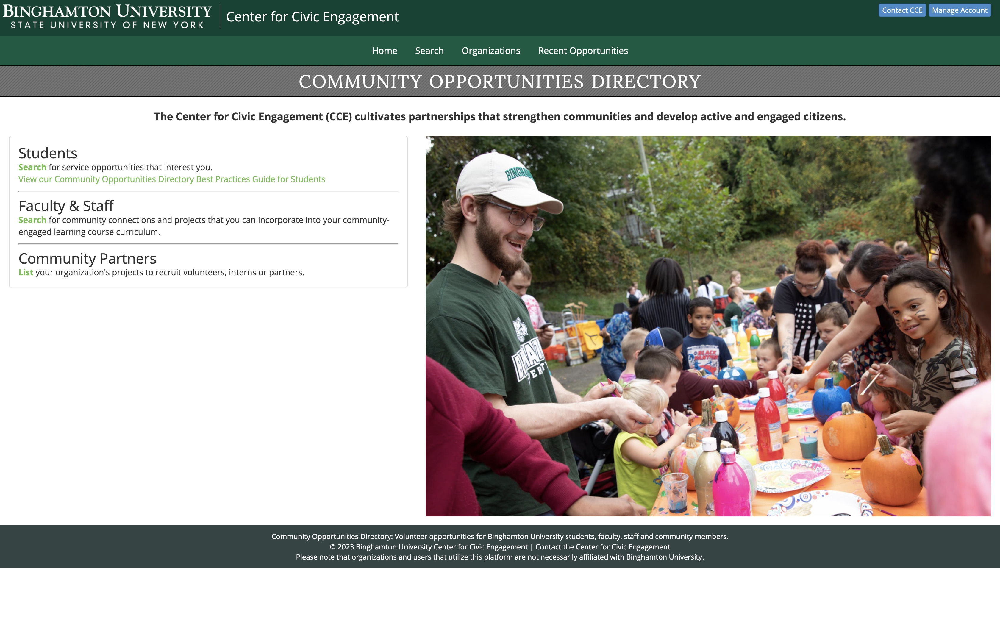
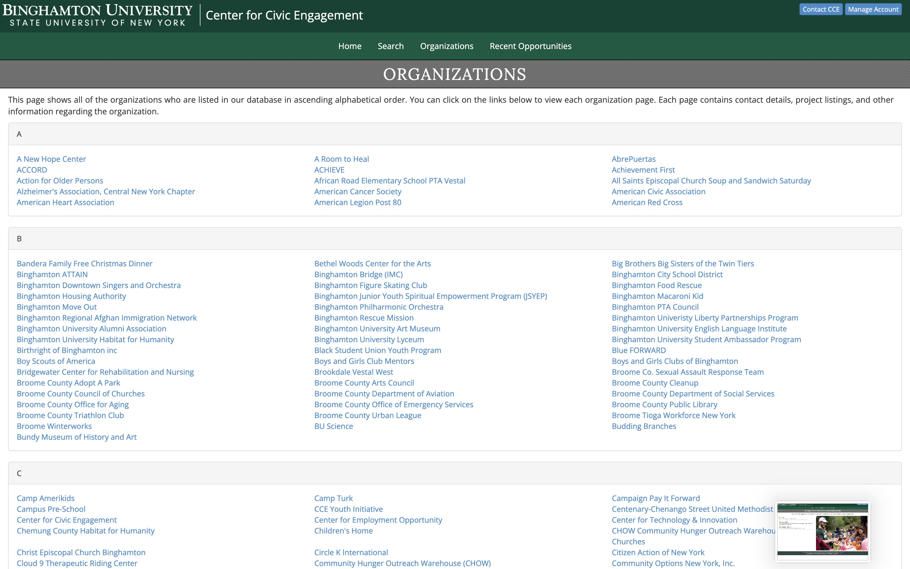
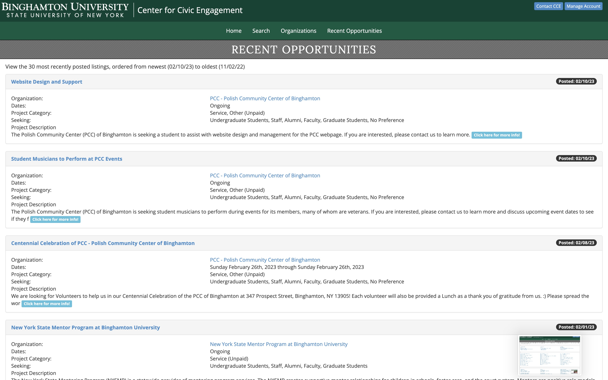
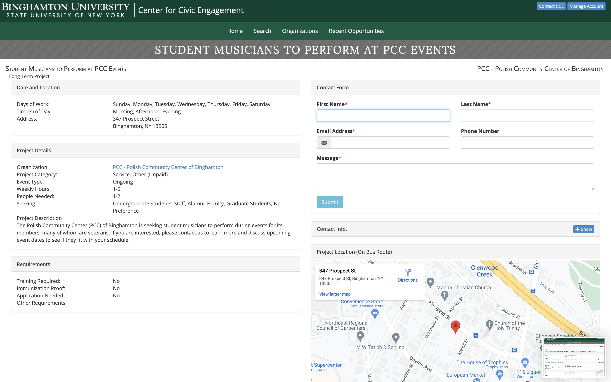
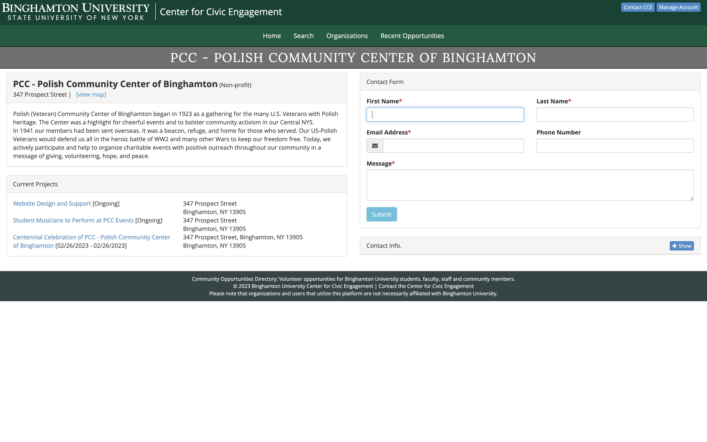

# Overview
The Binghamton University Center for Civic Engagement Community Opportunities Directory is an online tool that provides students with information about current community-based opportunities in which they can get involved. Students can select to search by project category (Internship, Research, Service, or Group Project) or by any of the 25 different fields of work, including education, health, politics and government, environmental issues and more. Search results will provide an in-depth description of the project along with a contact form to reach community organizations. 

[View the Community Opportuntities Directory](https://www.binghamton.edu/cce/volunteer/public/)

This github repository contains the source code for the Community Opportuntities Directory application.

# Screenshots 
### Home

### Organizations

### Recent Opportunities

### Project

### Listing

